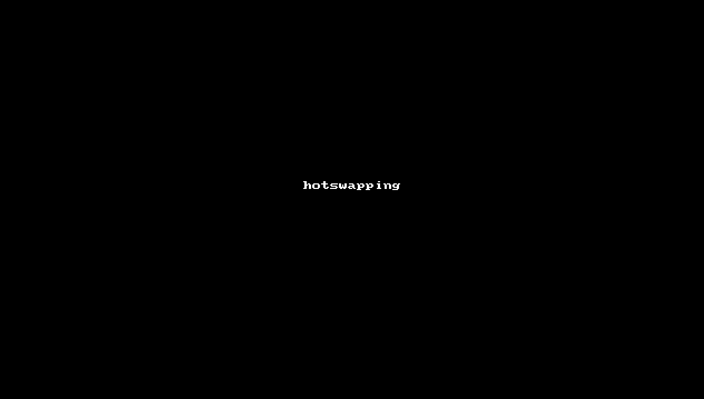

# Fennel Pong

Scaffolding a love2d project to use Fennel

- love2d: http://love2d.org/wiki/love

- fennel: https://github.com/bakpakin/Fennel

This was a learning exercise for me, and the end result is largely the result of me poking into other people's code. Almost nothing here is originally my own.

## How To

- clone this repo
- download love2d
- add the love executable to your path and `love .` from the root directory

## About Fennel

**Pros**:

- Get to write lisp for awesome lua frameworks like love2d and TIC-80

- Hot swapping / live reloading

    - 
    - Load changes to your code with a keypress without restarting your app
    - not unique to fennel. You can apparently use [lume/hotswap](https://github.com/rxi/lume#lumehotswapmodname) to do this in pure Lua

- REPL driven development

    - 
    - embed fennel in your lua and start its REPL, and any global variables are available in your REPL to inspect and tweak while your code is running.

- Full Lua interop: call any and all lua functions, built in or from a library

**Cons**:

- No sourcemaps: can be hard to debug fennel when line numbers don't line up

## How to use Fennel

### Option 1: Embedded

This is what we're doing here. Put a few files in `/lib`:

- Fennel - the executable. you can `lua lib/fennel --repl` to run the repl. or anything else you can do with fennel

Then require fennel in your lua project.

### Option 2: Install / Build

Meaning, install fennel, and use it to build lua files

2. Install luarocks: `brew isntall luarocks`

3. Install fennel: `luarocks install fennel`

You can for example run `fennel --compile main.fnl > main.lua` to turn Fennel into Lua.

Put this step in your Makefile or something to compile `.fnl` files into `.lua` files

## Resources

### Code and Blogs

- technomancy: wrote a couple of great games for Lisp Jam in Fennel and Love2d/TIC-80, all of which and more you can find in a series of blog posts starting here: https://technomancy.us/186

- selfsame: wrote Hats in the Deep, a game written for TIC-80 for a jam: https://selfsame.itch.io/hats

### Framework

- min-love2d-fennel: the project structure used here. https://gitlab.com/alexjgriffith/min-love2d-fennel/tree/master

### Editor support

- fennel vim: https://github.com/bakpakin/fennel.vim
- emacs fennel-mode: https://gitlab.com/technomancy/fennel-mode/

### Community

Visit #fennel on freenode.net
